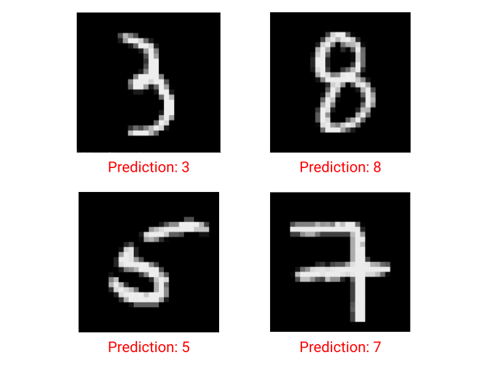
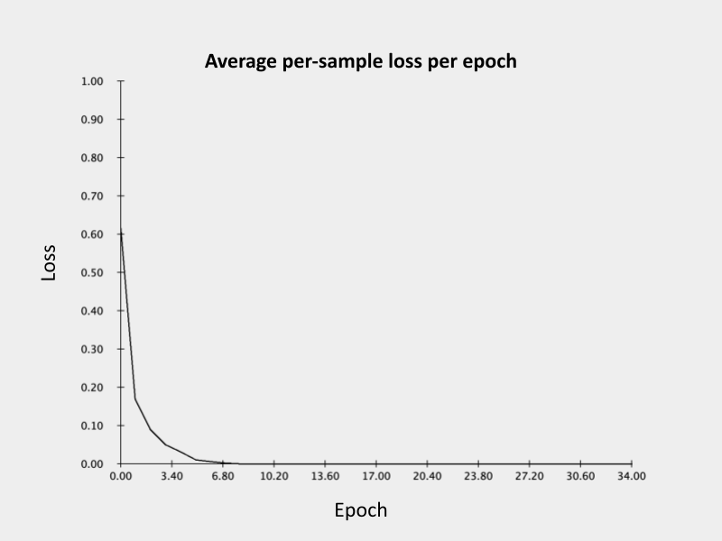
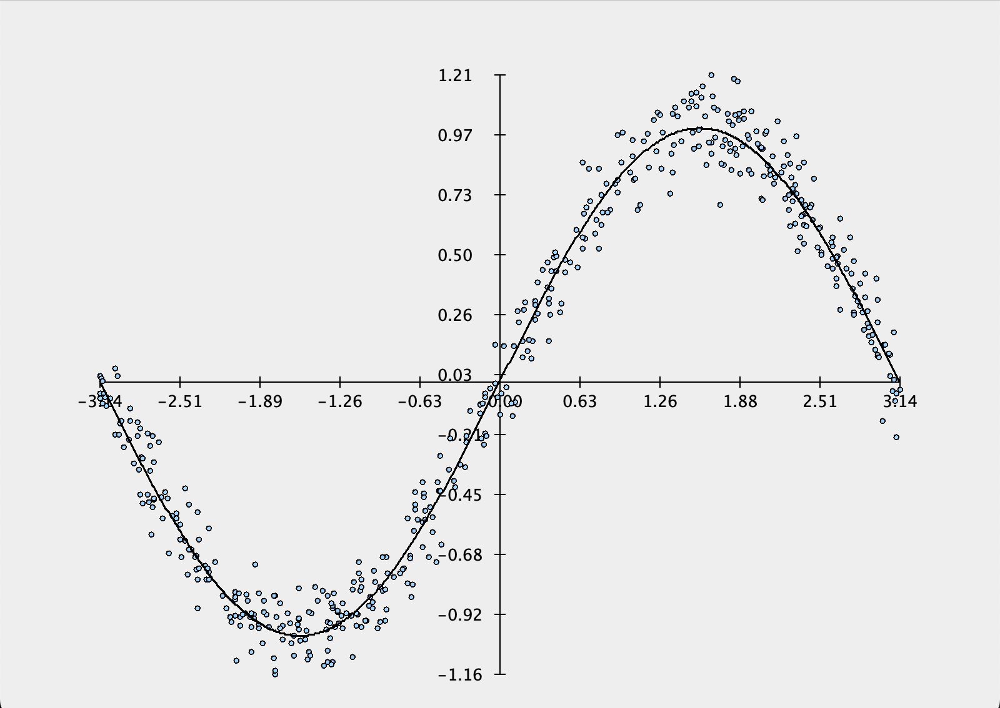
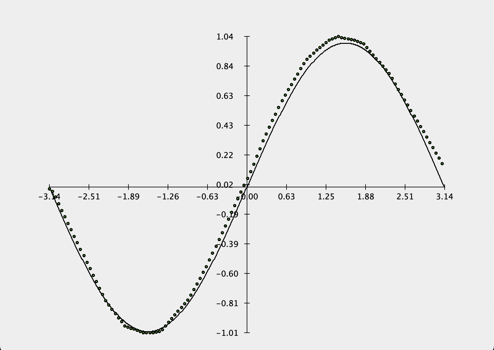
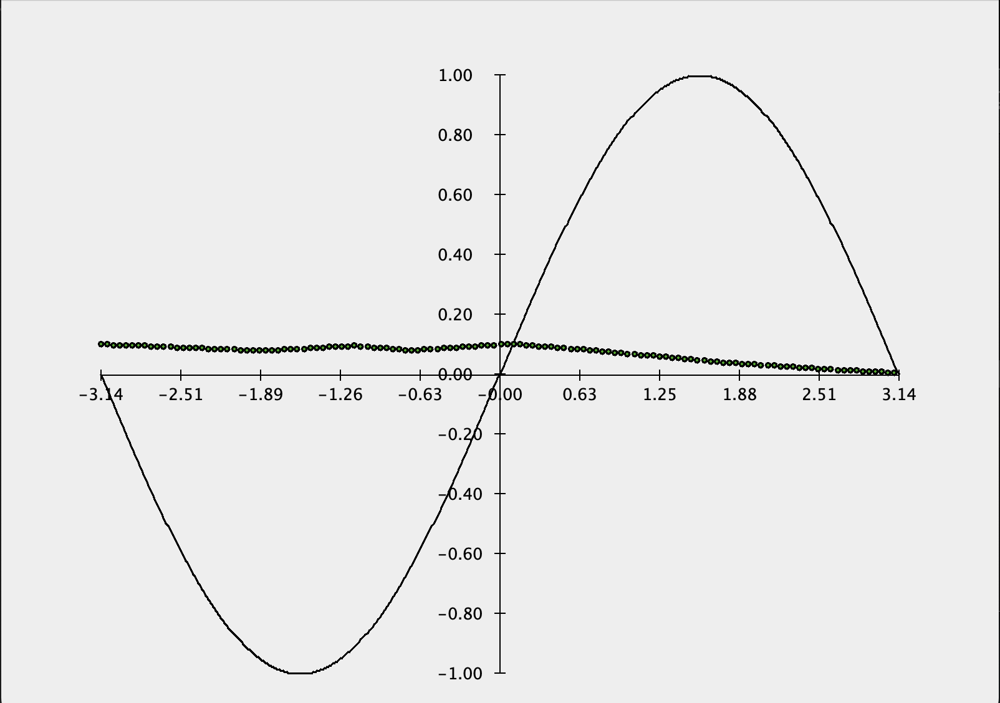
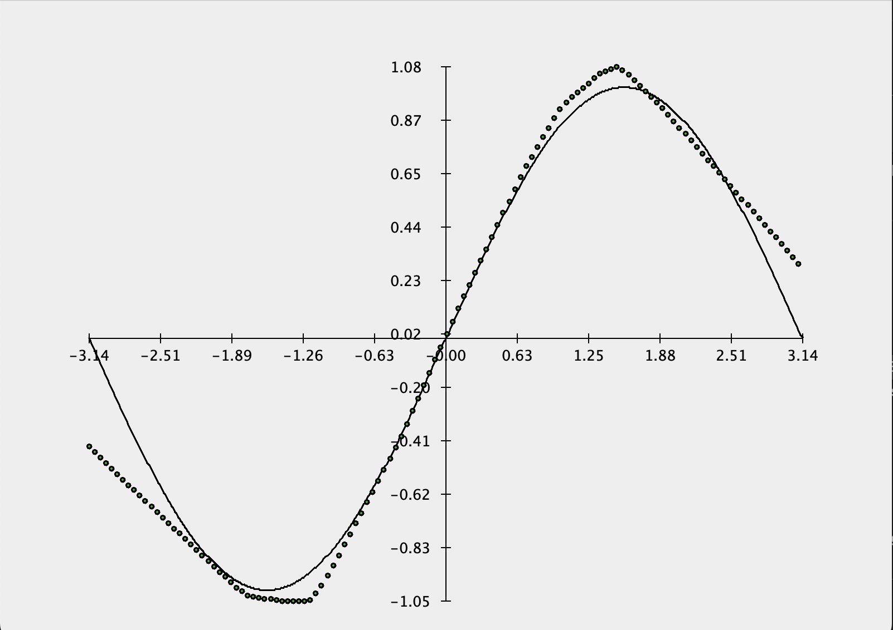

<p align="center">
  
</p>
<!-- credit: vecteezy -->

# matcha :tea::herb:
*Neural networks in Java.*

## Overview
A standalone, simple yet powerful neural networks library and tensor engine built on Java's standard library with torch-like API, multithreading, auto differentiation, and more. Inspired by [NumPy](https://numpy.org/), [PyTorch](https://pytorch.org/), and Andrej Karpathy's [micrograd](https://github.com/karpathy/micrograd).
- `matcha.datasets`: Pre-built and ready to train tensor-formatted datasets.
- `matcha.engine`: Main code for tensor operations, functions, threads, and differentiation. Modular and extensible.
- `matcha.nn`: Contains various useful neural network modules and loss functions.
- `matcha.optim`: Contains various optimization algorithms.
- `matcha.tea`: Automates training of neural networks.
- `matcha.utils`: Plotting, tensor visualizations, and more!

<!-- toc -->
## Quick Links
- [Features](#features)
  - [Tensors](#tensors)
  - [Automatic Differentiation](#automatic-differentiation)
  - [Neural Networks](#neural-networks)
  - [Modularity and Extensibility](#modularity-and-extensibility)
  - [Open Issues](#open-issues)
- [Example: MNIST](#example-k-classification-on-mnist)
- [Example: Regression](#example-regression-on-sine-wave-dataset)
<!-- tocstop -->

## Features
In large, matcha comprises two utilities: efficient N-d tensor computations and building large-scale modular neural networks. It serves as a standalone library that does not require any additional dependencies other than a satisfactory Java version (17+).

### Tensors
<p align="center">
  
</p>

matcha provides numerous functions to initialize, visualize, and efficiently operate on tensors (or N-dimensional arrays), which store a single array of doubles as the underlying datatype. As a result, all of the data stored in a Tensor object is contiguous in memory.
#### Initializing a tensor.
Tensors can be zero-initialized by specifying a shape
```Java
// initializes a tensor of shape (3, 2, 4).
Tensor t = new Tensor(3, 2, 4);
System.out.println(t);
```
```
Tensor(shape: (3, 2, 4))
[[  0.0,   0.0,   0.0,   0.0, 
    0.0,   0.0,   0.0,   0.0],
 [  0.0,   0.0,   0.0,   0.0, 
    0.0,   0.0,   0.0,   0.0],
 [  0.0,   0.0,   0.0,   0.0, 
    0.0,   0.0,   0.0,   0.0]]
```
or with a shape and the (flattened) data to store.
```Java
int[] shape = {2, 3};
double[] data = {1, 2, 3, 4, 5, 6};
Tensor t = new Tensor(shape, data);
```
```
Tensor(shape: (2, 3))
[  1.0,   2.0,   3.0, 
   4.0,   5.0,   6.0]
```
For ease of use, Tensors can also be constructed from any numerical array, of which it will automatically infer the shape of. Note that due to the constructors above, there is one exception: a Tensor constructed from an 1d array of ints will assume that the array specifies its shape and _not_ its data.
```Java
int[][][] arr = {
    {
        {1, 2, 3},
        {4, 5, 6}
    },
    {
        {7, 8, 9},
        {10, 11, 12}
    }
};

Tensor t = new Tensor(arr);
```
```
Tensor(shape: (2, 2, 3))
[[  1.0,   2.0,   3.0, 
    4.0,   5.0,   6.0],
 [  7.0,   8.0,   9.0, 
   10.0,  11.0,  12.0]]
```
#### Tensor operations.
Tensors support many useful and computationally fast operations. For example, one can easily construct a incrementally-filled tensor by reshaping
```Java
Tensor t = new Tensor(LinAlg.arange(12));
t.reshape(2, 2, 3);
```
```
Tensor(shape: (2, 2, 3))
[[  0.0,   1.0,   2.0, 
    3.0,   4.0,   5.0],
 [  6.0,   7.0,   8.0, 
    9.0,  10.0,  11.0]]
```
and then compute its exponential, maximum, sum, etc.
```Java
// we can find the maximums along the last dimension (-1)
t.max(-1);
// or leave it blank to just get the largest value.
t.max();
// sum along the second dimension.
t.sum(1);
// compute the tensor's exponential.
t.exp();
// multiplying/raising by a constant.
t.mul(5);
t.pow(2);
```
```
Tensor(shape: (2, 2))
[  2.0,   5.0, 
   8.0,  11.0]

11.0

Tensor(shape: (2, 3))
[  3.0,   5.0,   7.0, 
  15.0,  17.0,  19.0]

Tensor(shape: (2, 2, 3))
[[  1.0,   2.7,   7.4, 
   20.1,  54.6, 148.4],
 [403.4, 1096.6, 2981.0, 
  8103.1, 22026.5, 59874.1]]

Tensor(shape: (2, 2, 3))
[[  0.0,   5.0,  10.0, 
   15.0,  20.0,  25.0],
 [ 30.0,  35.0,  40.0, 
   45.0,  50.0,  55.0]]

Tensor(shape: (2, 2, 3))
[[  0.0,   1.0,   4.0, 
    9.0,  16.0,  25.0],
 [ 36.0,  49.0,  64.0, 
   81.0, 100.0, 121.0]]
```

A number of binary operations are also supported, such as threaded matrix multiplication and component-wise addition/multiplication.
```Java
Tensor t_a = new Tensor(new int[][]{
    {7, 2},
    {4, -5}
});

Tensor t_b = new Tensor(new int[][]{
    {11, 3},
    {3, 5}
});

// efficient matrix multiplication.
t_a.matmul(t_b);
t_a.sub(t_b);
t_a.div(t_b);
```
```
Tensor(shape: (2, 2))
[ 83.0,  31.0, 
  29.0, -13.0]

Tensor(shape: (2, 2))
[ -4.0,  -1.0, 
   1.0, -10.0]

Tensor(shape: (2, 2))
[  0.6,   0.7, 
   1.3,  -1.0]
```

Finally, operations can also be chained successively.
```Java
Tensor t_a = new Tensor(new int[][]{
    {7, 2},
    {4, -5}
});

Tensor t_b = new Tensor(new int[][]{
    {11, 3},
    {3, 5}
});

t_a.add(t_a.matmul(t_b)).max(-1);
```
```
Tensor(shape: (2))
[90.0, 33.0]
```
#### Converting between tensors and arrays.
Any tensor can also be converted into a static Java array.
```Java
double[][] arr = (double[][]) Tensors.toArray(t_a.matmul(t_b));
```

### Automatic Differentiation
Automatic differentiation and the calculation of gradients can easily be enabled on any tensor either by adding `true` as the last parameter in its contructor or by calling `t.withGrad(true)`. Similar to PyTorch, gradient chaining is computed by maintaining a list of child tensors so that their computation can be done automatically with a single call to the parent tensor. Also, the enabling of gradients propagates through operations, so that any operation that involves at least one tensor with gradients enabled will output a tensor that also has gradients enabled and mark the previous tensor as one of its children.
```Java
Tensor t_a = new Tensor(new int[][]{
    {7, 2},
    {4, -5}
}, true);

Tensor t_b = new Tensor(new int[][]{
    {11, 3},
    {3, 5}
}, true);

Tensor t_c = t_a.mul(t_b);
System.out.println(t_c);
```
```
Tensor(shape: (2, 2), gradEnabled=true)
[ 18.0,   5.0, 
   7.0,   0.0]
```
```Java
// set gradient to 1 and compute child gradients.
t_c.backward();
System.out.println(Tensors.showGrad(t_a));
```
```
[ 11.0,   3.0, 
   3.0,   5.0]
```

### Neural Networks
Built on top of its tensor and differentiation engine, `matcha.nn` provides modular components to build deep neural networks, such as popular activation layers (e.g. ReLU, tanh), outputs layers (e.g. softmax), and loss functions (e.g. MSE for regression, log loss for classification).
```Java
Sequential model = new Sequential(
	new Linear(42, 64),
	new ReLU(),
	new Linear(64, 64),
	new ReLU(),
	new Linear(64, 1)
);

System.out.println(model);
```
```
Sequential(
   Linear(in_features=42, out_features=64, bias=true)
   ReLU()
   Linear(in_features=64, out_features=64, bias=true)
   ReLU()
   Linear(in_features=64, out_features=1, bias=true)
)
```
```Java
Tensor x = new Tensor(1, 42);
System.out.println(model.forward(x));
```
```
[ -0.1]
```

### Modularity and Extensibility
matcha is designed to be easily extensible so that adding new neural network layers, tensor operations, and loss functions is easy. Many of the fields and methods in the Tensor class are protected instead of private, so that they can be shared with any classes implemented in `engine`. This allows the organization of functions that provide separate utilities to be cleanly separated and organized into their own files instead of being dumped into a single massive Tensor file (these files start with `FN_` and are largely static). As an example, N-d softmax is implemented as a static method in `engine.FN_Activations`, which is then be used to create a softmax layer by simply calling this method on an input tensor.

Generally, adding a neural network layer consists of the following:
1. Writing a function in `matcha.engine` and specifying the function to be static:
  ```Java
  public static Tensor tanh(Tensor t_A) { ...
  ```
2. Computing the data stored in the output tensor:
  ```Java
  double[] dOut = Arrays.stream(t_A.m_data).map(x -> Math.tanh(x)).toArray();
  ```
3. Checking if any of the input tensors have gradients enabled and marking them as children:
  ```Java
  if (t_A.m_gradEnabled) {
  	List<Tensor> children = new ArrayList<>();
  	children.add(t_A);
  
    	// t_B is the output tensor (i.e. t_B = tanh(t_A)).
  	t_B = new Tensor(t_A.m_shape, dOut, t_A.m_gradEnabled, children);
  	...
  ```
4. Writing the lambda backpropagation calculation on the input tensor assuming the output tensor's gradients are known:
  ```Java
  	// ddx tanh(x) = 1 - tanh^2(x)
  	Backward back = () -> {
  		for(int i = 0; i < t_A.m_grad.length; i++){
  			 t_A.m_grad[i] += (1-(t_B.m_data[i]*t_B.m_data[i])) * t_B.m_grad[i];
  		}
  	};
  ```
5. Setting the `backward` attribute of the output tensor to the lambda function and (optionally) specifying the backpropagation function:
  ```Java
  	t_B.m_backward = back;
  	t_B.m_gradFn = GradFunctions.TanhBackward;
  ```
6. If no gradient calculations are needed, then we can construct the output tensor without worrying about children of backpropagation functions:
  ```Java
  } else {
  	t_B = new Tensor(t_A.m_shape, dOut);
  }

  return t_B;
  ```
7. Adding a new class into `matcha.nn` which implements `Module` and calls the method:
  ```Java
  public class Tanh implements Module{

  	@Override
  	public Tensor forward(Tensor x){
		return FN_Activations.tanh(x);
  	}


  	@Override
  	public String toString(){
  		return "Tanh()";
    	}

  	@Override
  	public List<Tensor> parameters(){
  		return null;
  	}
  }
  ```


### Open Issues
- There is currently no way to save or load state dicts/models like in PyTorch.
- Some tensor operations, like matrix multiplication, are not supported in higher (n > 2) dimensions. This is mainly because there is no unified framework to broadcast or slice tensors yet, apart from AxisIterators.
- Many tensor operations are still awaiting a multithreaded counterpart.
- The plotting mini-library JPlot (in `matcha.utils`) is largely unfinished due to relevance. However, it has a strong backbone and would serve well as the base for a more comprehensive separate library.
- Tensors only store doubles and do not support templating so that the underlying datatype remains primitive. Thus, there does not currently exist tensors that support storing floats, ints, etc., and models cannot be quantized.
- Tensors with numbers of different widths can print in a staggered fashion that no longer looks very clean. This can temporarily be solved by changing the DEFAULT_FORMAT field in `utils.Tensors`, but it would be nice if this format could dynamically adjust so that all calls to print a tensor will format nicely.
- Adding more optimization algorithms, such as Adam, Adagrad, or momentum-based SGD.
- Adding more neural network modules, such as convolutional and pooling layers.
  
## Example: k-Classification on MNIST
 | 
|:-:|:-:|
<p align=center><b>Fig 1.</b> Example model outputs for given samples (left) and the loss curve during training (right).</p>

The Modified National Institute of Standards and Technology (MNIST) dataset consists of 60,000 training and 10,000 testing images of handwritten numeric digits, and is widely used for to train and test a variety of machine learning models. In this example, we demonstrate how to train a neural network with around 250,000 parameters on a sizeable subset of MNIST. Training the model took 30 minutes on an Apple M1 Pro, and achieved a test accuracy of 95.30%. To replicate this code, please download the dataset [here](https://www.kaggle.com/datasets/oddrationale/mnist-in-csv/data).

### Code
```Java
import matcha.nn.*;
import matcha.optim.*;
import matcha.datasets.MNIST;
import matcha.engine.Tensor;

public class MNISTExample {
    public static void main(String[] args) {
        Sequential model = new Sequential(
            new Linear(784, 256),
            new ReLU(),
            new Linear(256, 256),
            new ReLU(),
            new Linear(256, 10),
            new Softmax(-1) // softmax across the last dimension.
        );

        String train_file = "~/path/to/mnist_train.csv", test_file = "~/path/to/mnist_test.csv";
        int train_samples = 10_000, test_samples = 1000;
        int batch_size = 4;
        int n_epochs = 35;
        double learning_rate = 1e-3;

        MNIST train_data = new MNIST(train_file, train_samples, batch_size);
        // shape of data is by default (batch_size, 28, 28).
        train_data.reshapeX(784); 
        MNIST test_data = new MNIST(test_file, test_samples);
        test_data.reshapeX(784);

        Loss loss_fn = new LogLoss();

        // we optimize via traditional gradient descent.
        Optimization optim = new SGD(model.parameters(), learning_rate);

	System.out.println("Starting training...");
        for (int i = 1; i <= n_epochs; i++) {
            double running_loss = 0.;
            for (var sample : train_data) {
                // get features and targeets per batch.
                Tensor X = sample.get(0), y = sample.get(1);

                // always zero gradients before propagating!
                optim.zeroGrad();

                Tensor outputs = model.forward(X);

                // calculate batched loss.
                Tensor loss = loss_fn.loss(outputs, y);

                // backprop gradients.
                loss.backward();

                // apply optimization step.
                optim.step();

                running_loss += loss.item();
            }

            if (i % 5 == 0) System.out.println(
                String.format("Epoch: %d, average loss: %4.4f", i, running_loss / train_data.size())
            );
        }

        // next, we measure test accuracy.
        int n_correct = 0;

	System.out.println("Starting testing...");
        for (var sample : test_data) {
            Tensor X = sample.get(0), y = sample.get(1);

            Tensor outputs = model.forward(X);

            // argmax across the last dimension.
            int y_pred = (int) outputs.argmax(-1).item();

            // if the prediction is correct, increment counter.
            if ((int) y.item() == y_pred) n_correct++;
        }

        System.out.println(String.format("Test accuracy: %2.2f%%", ((double) n_correct) / test_data.size() * 100));
    }
}
```
```
Starting training...
Epoch: 5, average loss: 0.0230
Epoch: 10, average loss: 0.0005
Epoch: 15, average loss: 0.0003
Epoch: 20, average loss: 0.0002
Epoch: 25, average loss: 0.0002
Epoch: 30, average loss: 0.0001
Epoch: 35, average loss: 0.0001
Starting testing...
Test accuracy: 95.30%
```
### Code (using Matcha.tea)
```Java
import matcha.datasets.MNIST;
import matcha.nn.*;
import matcha.tea.Matcha;

class MNISTExample {
	public static void main(String[] args) {
		Sequential model = new Sequential(
            new Linear(784, 256),
            new ReLU(),
            new Linear(256, 256),
            new ReLU(),
            new Linear(256, 10),
            new Softmax(-1) // softmax across the last dimension.
        );

        String train_file = "~/path/to/mnist_train.csv", test_file = "~/path/to/mnist_test.csv";
        int train_samples = 10_000, test_samples = 1000;
        int batch_size = 4;
        int n_epochs = 35;

        MNIST train_data = new MNIST(train_file, train_samples, batch_size);
        // shape of data is by default (batch_size, 28, 28).
        train_data.reshapeX(784);
        MNIST test_data = new MNIST(test_file, test_samples);
        test_data.reshapeX(784);
		
        Loss loss_fn = new LogLoss();

        // initialize matcha module.
        Matcha matcha = new Matcha(model, train_data, loss_fn);

        // train model.
        matcha.brew(n_epochs);

        // plot loss curve.
        matcha.plot();

        // test model performance.
        matcha.sip(test_data);
	}
}
```
```
TRAINING LOG:
-------------
|████████                                          |(14%) Epoch: 5, loss/epoch: 0.0329
|███████████████                                   |(28%) Epoch: 10, loss/epoch: 0.0006
|██████████████████████                            |(42%) Epoch: 15, loss/epoch: 0.0003
|█████████████████████████████                     |(57%) Epoch: 20, loss/epoch: 0.0002
|████████████████████████████████████              |(71%) Epoch: 25, loss/epoch: 0.0002
|███████████████████████████████████████████       |(85%) Epoch: 30, loss/epoch: 0.0001
|██████████████████████████████████████████████████|(100%) Epoch: 35, loss/epoch: 0.0001
Time elapsed: 30 minutes and 19.57 seconds.
average test loss: 0.0812
```


## Example: Regression on Sine Wave Dataset
<details>
    <summary>Description</summary>
Here is a simple example of a Multi-Layer Perceptron built entirely in matcha trained on the `SineWave` toy dataset. The dataset generates $n$ random uniform values $x_i$ across $a$ to $b$ and the corresponding value $y_i$ such that $y_i = A\sin{(\omega x_i + \phi)} + N(\mu, \sigma)$, where $N$ denotes random noise values selected across a Gaussian distribution with mean $\mu$ and standard deviation $\sigma$. The default values for the dataset are $a=-\pi$, $b=\pi$, $A=1$, $\omega=1$, $\phi=0$, $\mu=0$, and $\sigma=0.1A$. These settings can be updated either by passing a partial or complete configuration mapping or during initialization (see `matcha.datasets.toy.SineWave`). All figures were created using `matcha.utils.jPlot`.

 | 
|:-:|:-:|
<p align=center><b>Fig 1.</b> The original SineWave dataset (left) and the model's predictions after 20 epochs (right) against the actual underlying sine function (solid line).</p>

 | 
|:-:|:-:|
<p align=center><b>Fig 2.</b> The model's predictions without training (left) and after 5 epochs (right).</p>
</details>
<details>
    <summary>Code</summary>
	
### Code
```Java
import matcha.datasets.toy.SineWave;
import matcha.engine.Tensor;
import matcha.nn.*;
import matcha.nn.Module;
import matcha.optim.*;
import matcha.utils.*;
import matcha.utils.math.LinAlg;

import java.util.ArrayList;
import java.util.List;
import java.util.Arrays;

public class Example{
    public static void main(String[] args) throws Exception{
        // constructing a simple network
        List<Module> layers = new ArrayList<>();
        layers.add(new Linear(1, 16));
        layers.add(new ReLU());
        layers.add(new Linear(16, 16));
        layers.add(new ReLU());
        layers.add(new Linear(16, 1));

        Sequential model = new Sequential(layers);

        // prints model information, such as layers and dimensions
        System.out.println(model);
```
```
        Sequential(
        Linear(in_features=1, out_features=16, bias=true)
        ReLU()
        Linear(in_features=16, out_features=16, bias=true)
        ReLU()
        Linear(in_features=16, out_features=1, bias=true)
        )
```
```Java
        // initialize sine dataset
        SineWave sineData = new SineWave();
        // train model for 20 epochs
        int epochs = 20;

        // optimizer and loss function
        Optimization optim = new SGD(model.parameters(), 0.05); // 0.05 learning rate
        Loss lossFn = new MSELoss();    

        // train loop
        for(int i = 0; i < epochs; i++){
            double lossSum = 0; // running loss
            for(List<Tensor> batch : sineData){
                // each batch is a list of an input and target tensor
                Tensor inputs = batch.get(0);
                Tensor targets = batch.get(1);

                // zero gradients for every batch!!
                optim.zeroGrad();

                // make batch predictions
                Tensor outputs = model.forward(inputs);

                // calculate loss and compute gradients
                Tensor loss = lossFn.loss(outputs, targets);
                loss.backward();

                // apply gradients
                optim.step();

                lossSum += loss.data()[0];
            }
            // print average loss per batch
            if (i % 5 == 4 || i == 0)
                System.out.println("Epoch: " + (i + 1) + ", average loss: " + (lossSum / sineData.size()));
        }
```
```
            Epoch: 1, average loss: 0.1550326100760993
            Epoch: 5, average loss: 0.022698460109599656
            Epoch: 10, average loss: 0.017641122802328508
            Epoch: 15, average loss: 0.01622257515469674
            Epoch: 20, average loss: 0.015308237926187455
```
```Java
        // initialize new figure
        jPlot plt = new jPlot();

        // uncomment to plot dataset samples
        // for(List<Tensor> batch : sineData){
        //     plt.scatter(batch.get(0), batch.get(1));
        // }


        // generate and plot true sine values on the figure
        double[] xs = LinAlg.arange(-Math.PI, Math.PI, 0.01);
        plt.plot(xs, Arrays.stream(xs).map(x -> Math.sin(x)).toArray());

        // change color of scatter markers using a configuration mapping
        Map<String, Object> plotConfig = new HashMap<>();
        plotConfig.put("fill_color", "#55a630");

        // plot post-train predictions across x axis on the figure
        for(double x : LinAlg.arange(-Math.PI, Math.PI, 0.05)){
            Tensor t_X = new Tensor(new int[]{1, 1}, new double[]{x});
            Tensor t_Y = model.forward(t_X);
            plt.scatter(t_X, t_Y, plotConfig);
        }

        // display figure
        plt.show();
    }
}
```
```
See figures above for plot outputs.
```
</details>
